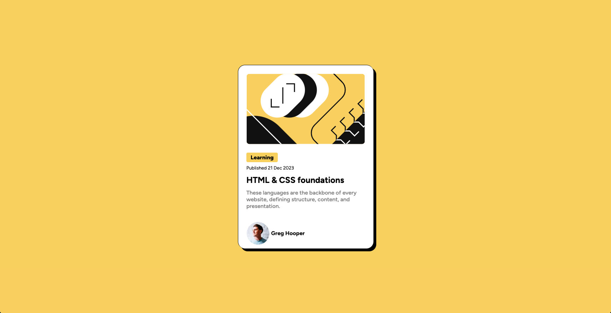
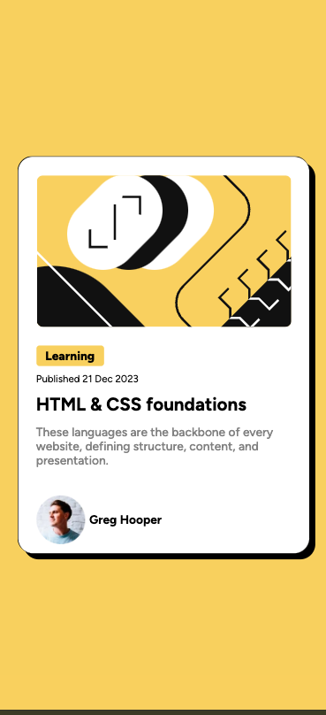
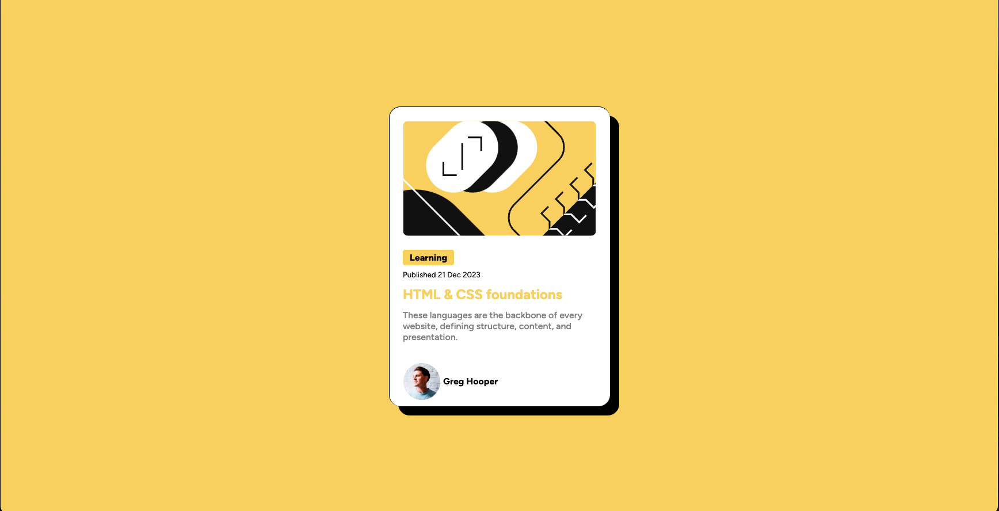

# Frontend Mentor - Blog preview card solution

This is a solution to the [Blog preview card challenge on Frontend Mentor](https://www.frontendmentor.io/challenges/blog-preview-card-ckPaj01IcS). Frontend Mentor challenges help you improve your coding skills by building realistic projects. 

## Table of contents

- [Overview](#overview)
  - [The challenge](#the-challenge)
  - [Screenshot](#screenshot)
  - [Links](#links)
- [My process](#my-process)
  - [Built with](#built-with)
  - [What I learned](#what-i-learned)
  - [Continued development](#continued-development)
  - [Useful resources](#useful-resources)
- [Author](#author)

## Overview

### The challenge

Users should be able to:

- See hover and focus states for all interactive elements on the page

### Screenshot 📷
**DeskTop**

**Mobile**

**Hover State on DeskTop**

### Links 🕸️

- Solution URL: https://github.com/ownedbyanonymous/blog-preview-card-main
- Live Site URL: https://blog-preview-card-main-lake-mu.vercel.app/

## My process

### Built with 🧰

- Semantic HTML5 markup
- CSS
- Flexbox

### What I learned 👩🏾‍🏫

Going through this exercise reinforced my knowledge of Flexbox, how to center divs and images and HTML5. I also learnt how use the CSSbox-shadow property.

### Continued development 👩🏽‍💻
Flexbox: other properties and concepts not coveres in the challenge.
Deepen my understanding of the transform property
Read on the use cases for em and rem

### Useful resources 📚

- [Resource 1](https://www.w3schools.com/cssref/css3_pr_box-shadow.php) - This helped me understand the use of box-shadow property.

## Author 📝

- Frontend Mentor - [@ownedbyanonymous](https://www.frontendmentor.io/profile/ownedbyanonymous)

